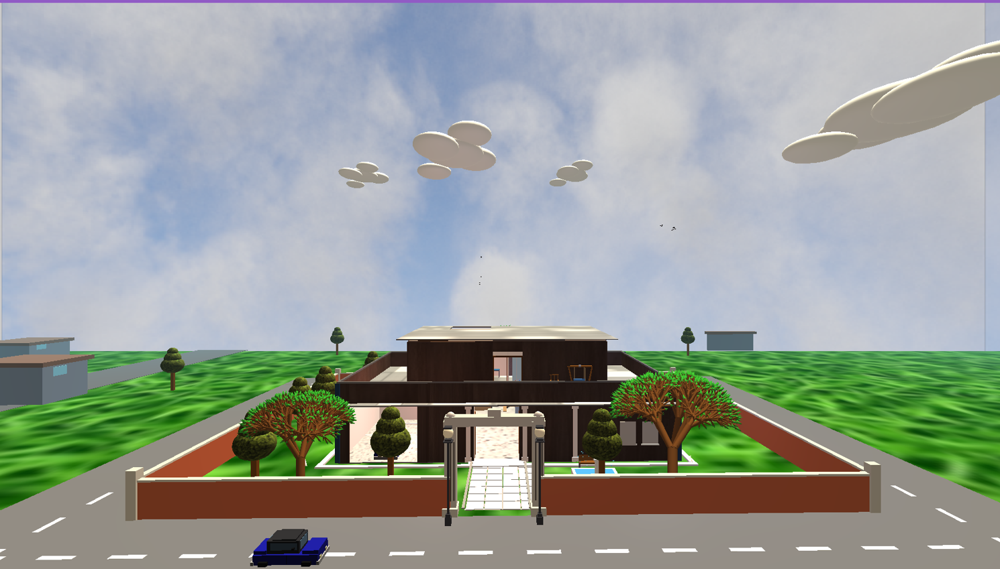
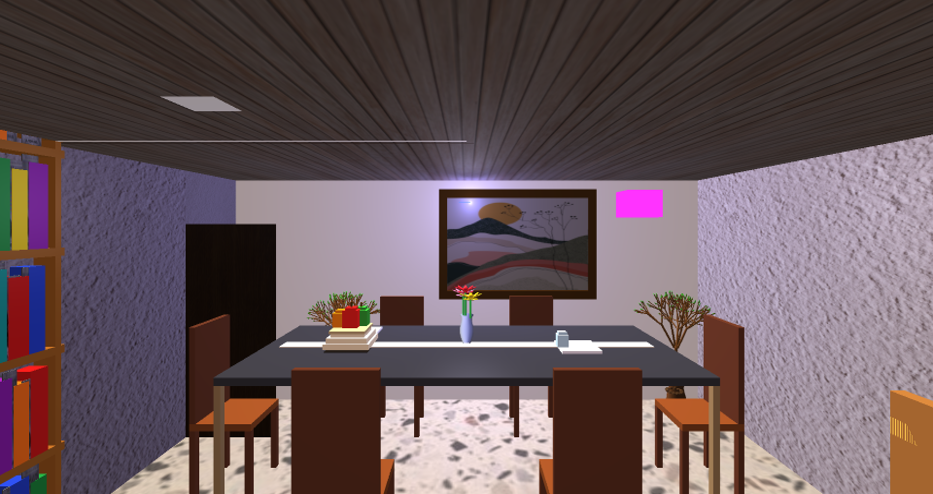
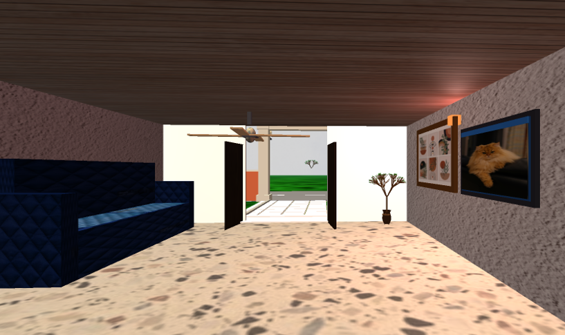
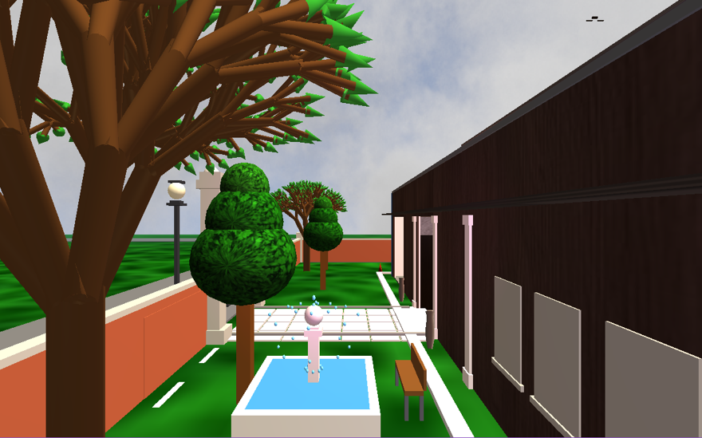

# 🏠 Graphics Project — 3D Apartment Simulation

A fully interactive **3D Apartment Simulation** built with **OpenGL 3.3** as part of the **CSE 4208: Computer Graphics Laboratory** course at **KUET (Khulna University of Engineering & Technology)**.

---

## 📸 Screenshots


| Overview | Lighting | texture | Outdoor |
|----------|----------|---------|
|  |  |  |  |


---

## 🎥 Demo Video


> 📺 **Watch the full demo here:** [Click to Watch on Google Drive](https://drive.google.com/file/d/1eF5qUYs6WyxdkaXNVFCg2e_l-TB_KwJI/view?usp=drive_link) 


---

## 📋 Project Info

| Field | Details |
|-------|---------|
| **Student** | Sumaiya Khan |
| **Roll** | 2007031 |
| **Course** | CSE 4208 — Computer Graphics Laboratory |
| **Supervisor** | Dr. Sk. Md. Masudul Ahsan (Professor, CSE, KUET) |
| **Co-supervisor** | Md Tajmilur Rahman (Lecturer, CSE, KUET) |
| **Institution** | Khulna University of Engineering & Technology |

---

## 🌟 Features

### 🔦 Lighting System
- **Directional, Point, and Spot** lights — all keyboard-toggleable
- **Phong Lighting Model** with Ambient, Diffuse, and Specular components
- Realistic surface shading and depth enhancement

### 🖼️ Texture Mapping
- Simple, vertex-blended, and fragment-blended textures
- Applied to floors, walls, ceilings, stairs, furniture, and outdoor ground
- **Skybox cubemap** for surrounding sky environment
- **TV slideshow** cycling through 3 images every 4 seconds

### 🎬 Animations & Interactions

| Feature | Description |
|---------|-------------|
| 🌀 Ceiling Fan | Continuously rotating |
| 🚪 Doors | Open/close toggle |
| 🛗 Lift | Moves between floors |
| ⛲ Fountain | Parabolic water arc animation |
| 🐦 Birds & Clouds | Animated flying across the scene |
| 🚗 Car | Auto-driving + manual keyboard control |
| 🚿 Tap | Water pouring animation in washroom |
| ❄️ AC | ON/OFF toggle |
| 📺 TV Screen | Animated image slideshow |
| 🌳 Fractal Trees | Recursive branching algorithm |

### 📷 Camera & Viewing
- Free movement: `W`, `A`, `S`, `D`
- **Pitch, Yaw, Roll** controls
- **Bird's Eye View**
- Viewport split into **4 equal sections**

### 🏗️ Object Modeling
- Primitives: Cubes, Cylinders, Spheres
- **Bezier Surface** (surface of revolution) — vases, arches, domes, pillars
- **Fractal Trees** — recursive branching up to configurable depth
- **Ruled Surface** — terracotta flower pots with sine-spline top rim

### 🏠 Rooms & Areas
- Living room with bookshelf, sofa, and furniture
- Dining area with table and chairs
- Bedroom (ground floor + top floor)
- Kitchen with fridge (openable door) and cabinets
- Bathroom with animated tap
- Outdoor area: garage, balcony with porch swing, garden with fountain

---

## 🛠️ Tools & Technologies

| Tool | Purpose |
|------|---------|
| **OpenGL 3.3** | Core 3D rendering |
| **GLFW** | Window creation & input handling |
| **GLAD** | OpenGL function pointer loader |
| **GLEW** | OpenGL extension management |
| **stb_image** | Image loading for textures |
| **C++** | Programming language |

---

## 🚀 Getting Started

### Prerequisites
- OpenGL 3.3 compatible GPU
- C++ compiler (MSVC / GCC / Clang)
- GLFW, GLEW, GLAD libraries installed

### Build & Run

```bash
# Clone the repository
git clone https://github.com/sumaiyashifa/Graphics-project.git
cd Graphics-project/apartment

# Build (adjust based on your build system)
cmake . && make

# Or with g++
g++ main.cpp -o apartment -lGL -lGLU -lglfw -lGLEW
./apartment
```

---

## ⌨️ Controls

## ⌨️ Controls

### 📷 Camera
| Key | Action |
|-----|--------|
| `W / S / A / D / Q / E` | Move camera |
| `I / K` | Pitch up / down |
| `J / L` | Yaw left / right |
| `U / O` | Roll left / right |
| `LEFT SHIFT + above` | 4x fast movement |

### 💡 Lighting
| Key | Action |
|-----|--------|
| `1` | Toggle Directional Light |
| `2` | Toggle Point Lights (all) |
| `3` | Toggle Spot Light |
| `5` | Toggle Ambient component |
| `6` | Toggle Diffuse component |
| `7` | Toggle Specular component |

### 🖼️ Texture Modes
| Key | Action |
|-----|--------|
| `T` | Cycle texture mode: 0 = No Texture → 1 = Simple → 2 = Vertex-Blended → 3 = Fragment-Blended |

### 🎮 Interactions
| Key | Action |
|-----|--------|
| `G` | Toggle Ceiling Fan |
| `M / N` | Open / Close Doors |
| `X / P` | Open / Close Fridge Door |
| `4` | Toggle Bathroom Tap Water |
| `8` | Toggle AC (Ground Floor) |
| `0` | Toggle Table Lamp (Top Floor) |

### 🖥️ Viewport
| Key | Action |
|-----|--------|
| `9` | Toggle 4-Split Viewport |

### ❌ Other
| Key | Action |
|-----|--------|
| `ESC` | Quit |

---

## 📂 Repository Structure

```
Graphics-project/
├── apartment/              # Source code & assets
├── 2007031_Presentation_3D_Apartment_simulation.pptx
├── 2007031_Report_3D_Apartment_Simulation.pdf
└── README.md
```

---

## 📄 Report & Slides

- 📑 [Project Report (PDF)](./2007031_Report_3D_Apartment_Simulation.pdf)
- 📊 [Presentation Slides (PPTX)](./2007031_Presentation_3D_Apartment_simulation.pptx)

---

## 👩‍💻 Author

**Sumaiya Khan** — Roll: 2007031  
Department of Computer Science & Engineering  
Khulna University of Engineering & Technology (KUET)

---

*Made with ❤️ and lots of OpenGL debugging.*
